<div align="center">



<br/>

<a href="mailto:arunrout900@gmail.com"></a>
<a href="https://github.com/arunessential"></a>
<a href="https://www.linkedin.com/"></a>

</div>

---

<div align="center">

## ⚡ DEVOPS ENGINEER • CLOUD • AUTOMATION • KUBERNETES

`AWS` `Azure` `Kubernetes` `Terraform` `Docker` `Jenkins` `GitHub Actions` `Ansible`

</div>

---

# 🧑‍💻 ABOUT ME

> **DevOps & Cloud Engineer with 5.4+ years of experience** designing, automating and scaling cloud infrastructure and CI/CD platforms across banking and FMCG environments.

I focus on building reliable production systems using **AWS, Kubernetes, Docker, Terraform, Jenkins, GitHub Actions and Ansible**, with an emphasis on automation, security, observability and high availability.

### 🎯 What I do

| Area | Focus |
|---|---|
| ☁️ Cloud | AWS infrastructure, networking, compute, storage and security |
| ☸️ Kubernetes | EKS, deployments, services, scaling and troubleshooting |
| 🔄 CI/CD | Jenkins, GitHub Actions, GitLab CI |
| 🏗️ IaC | Terraform and CloudFormation |
| 🐳 Containers | Docker and containerized application delivery |
| ⚙️ Automation | Ansible and shell-based operational automation |
| 📊 Observability | CloudWatch, Prometheus, Grafana, Dynatrace |
| 🔐 Security | IAM, RBAC, Security Groups, MFA and secrets |

---

# 📊 CAREER DASHBOARD

<div align="center">

| 🧑‍💻 Experience | ☁️ Primary Cloud | ☸️ Orchestration | 🏗️ IaC | 🔄 CI/CD |
|:---:|:---:|:---:|:---:|:---:|
| **5.4+ Years** | **AWS** | **Kubernetes / EKS** | **Terraform** | **Jenkins / GitHub Actions** |

</div>

---

# 🛠️ TECHNOLOGY ORBIT

### ☁️ Cloud Platforms


**AWS:** EC2 • VPC • EBS • EFS • S3 • ELB/ALB • Auto Scaling • IAM • Route 53 • CloudWatch • RDS • Lambda • CloudFront • ECR • EKS

### 🚀 DevOps & Platform


**Docker • Kubernetes • Terraform • Ansible • Jenkins • GitHub Actions • GitLab CI**

### 📦 Build / Quality

**Maven • Nexus • SonarQube**

### 📈 Monitoring & Observability

**Amazon CloudWatch • Prometheus • Grafana • Dynatrace**

### 🐧 Systems

**Linux • RHEL • CentOS • Windows • Nginx • Apache • Tomcat**

---

# 💼 EXPERIENCE TIMELINE

```text
2019                 2021                 2022                 2024                 Present
 │                     │                    │                     │
 ▼                     ▼                    ▼                     ▼
NCORE ──────────────── NCORE ───────────── Digitup ───────────── Wipro
Associate Engineer     DevOps Engineer      DevOps Engineer      DevOps Engineer
Tenaga Nasional        Nestlé               Unilever             UBS
```

## 🏢 Wipro Limited — DevOps Engineer

**Client: UBS** · `Jan 2024 – Jun 2025`

`Git` `GitLab` `Jenkins` `Maven` `Nexus` `SonarQube` `Docker` `Kubernetes` `AWS` `Linux`

- Architected and maintained end-to-end CI/CD pipelines, reducing release time by **40%**.
- Led containerization initiatives using Docker and Kubernetes (EKS).
- Designed and deployed highly available AWS infrastructure across VPC, EC2, IAM, ALB, Auto Scaling and Route 53.
- Built reusable CloudFormation templates for consistent infrastructure provisioning.
- Automated operational workflows using Ansible, reducing manual intervention by **30%+**.
- Implemented secure deployment strategies using IAM roles, RBAC and secrets management.
- Troubleshot Kubernetes failures, CI/CD pipeline issues, SSL and networking problems.
- Improved monitoring and observability using CloudWatch and logging systems.

---

## 🏢 Digitup Solutions — DevOps Engineer

**Client: Unilever** · `Mar 2022 – Mar 2023`

`Git` `GitHub` `Maven` `Nexus` `SonarQube` `GitHub Actions` `Terraform` `Docker` `AWS` `Linux` `Ansible`

- Built scalable CI/CD pipelines using GitHub Actions for automated build-test-deploy workflows.
- Designed and deployed multi-environment AWS infrastructure using Terraform.
- Integrated Terraform with CI/CD pipelines to prevent configuration drift.
- Managed artifact lifecycle using Nexus.
- Automated application deployments using Ansible.
- Configured and maintained Nginx, Apache and Tomcat servers.
- Optimized Linux systems for performance, security and reliability.

---

## 🏢 NCORE Technology — DevOps Engineer

**Client: Nestlé** · `Feb 2021 – Mar 2022`

`Git` `Jenkins` `Maven` `Nexus` `Docker` `Terraform` `AWS` `Linux` `Grafana`

- Migrated monolithic applications to Docker-based microservices.
- Improved deployment speed by approximately **70%** through containerization and automation.
- Built CI/CD pipelines using Jenkins and GitHub Actions.
- Managed Kubernetes deployments and scaling strategies.
- Implemented Terraform-based infrastructure provisioning.
- Strengthened cloud security using IAM, Security Groups, MFA and network controls.
- Designed Auto Scaling and Load Balancing strategies for high availability.

---

## 🏢 NCORE Technology — Associate Software Engineer

**Client: Tenaga Nasional Berhad** · `Jun 2019 – Feb 2021`

`Excel` `Planisware` `Google Spreadsheet` `SQL`

- Developed dashboards and reports using SQL and Excel.
- Collaborated with stakeholders to optimize processes and reporting systems.

---

# 🚀 FEATURED PROJECTS

## 🌐 CloudWatch Lite — Website Monitoring & Alert Platform

**SaaS • 3-Tier Application • AWS**

```text
                         ┌───────────────────┐
                         │      USERS        │
                         └─────────┬─────────┘
                                   │
                                   ▼
                    ┌─────────────────────────┐
                    │   React.js Frontend     │
                    │      Dashboard          │
                    └────────────┬────────────┘
                                 │
                                 ▼
                    ┌─────────────────────────┐
                    │ Node.js / Express API   │
                    │                         │
                    │ Health Checks            │
                    │ Metrics • Alerts • APIs │
                    └────────────┬────────────┘
                                 │
                                 ▼
                    ┌─────────────────────────┐
                    │      RDS / MySQL        │
                    │ Monitoring History      │
                    └─────────────────────────┘
```

### Highlights

- HTTP health checks every **30–60 seconds**
- Response-time and status-code collection
- Uptime and performance dashboards
- Email alerting
- Historical monitoring data in Amazon RDS
- Availability and performance analysis

---

## 🗄️ RDS Snapshot Automation

**AWS Lambda • EventBridge • IAM**

- Serverless automated database backup solution
- Cron-based snapshot scheduling
- IAM roles and policies for controlled access
- Troubleshooting of EventBridge triggers and permissions

---

## ☸️ Containerized Deployment Pipeline

**Jenkins • GitHub Actions • Docker • Kubernetes**

```text
Developer
    │
    ▼
 Git Repository
    │
    ▼
 CI/CD Pipeline
    │
    ├── Build
    ├── Test
    ├── SonarQube
    ├── Docker Build
    └── Image Push
            │
            ▼
       Kubernetes / EKS
            │
            ▼
      Application Pods
```

---

# 🎓 EDUCATION

### Bachelor of Technology — B.Tech

**ITER, Bhubaneswar**  
`Aug 2012 – Jun 2016`

---

# 🌍 LANGUAGES

`English` • `Hindi` • `Odia` • `Telugu` • `Spanish — Basics`

---

# 🧠 DEVOPS MINDSET

<div align="center">

### `PLAN` → `AUTOMATE` → `DEPLOY` → `MONITOR` → `IMPROVE`

<br/>

**Infrastructure should be reproducible.**  
**Deployments should be automated.**  
**Systems should be observable.**  
**Production should be reliable.**

</div>

---

# 📫 CONNECT

<div align="center">

<a href="mailto:arunrout900@gmail.com">📧 Email</a>
&nbsp;&nbsp;•&nbsp;&nbsp;
<a href="https://github.com/arunessential">🐙 GitHub</a>
&nbsp;&nbsp;•&nbsp;&nbsp;
<a href="https://www.linkedin.com/">💼 LinkedIn</a>

<br/><br/>

`AWS` `KUBERNETES` `TERRAFORM` `DOCKER` `JENKINS` `CI/CD` `DEVOPS`

</div>
